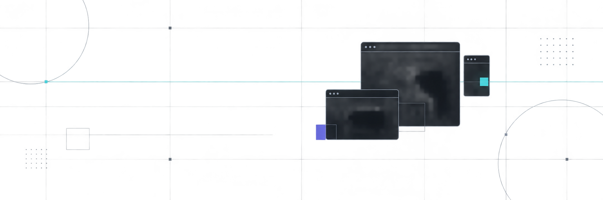

  

<h1 align="center">Привет, я kyroichi 👋</h1>

  Создаю небольшие Windows-приложения, которые убирают лишние действия из повседневной работы.

  
  
  
  

## Избранные проекты

| Проект | Что делает | Технологии |
|---|---|---|
| [Primary Monitor Screen](https://github.com/kyroichi/primary-monitor-screen) | Print Screen для выбранного монитора | AutoHotkey v2, PowerShell |
| [Voice Layout Switcher](https://github.com/kyroichi/voice-layout-switcher) | Офлайн-переключение раскладки голосом | Python, Vosk |
| [Network OneClick Changer](https://github.com/kyroichi/network-oneclick-changer) | Сетевая идентификация, диагностика и откат | C#, .NET |
| [Velora Compress](https://github.com/kyroichi/velora-compress) | Простое пакетное сжатие видео | Windows, FFmpeg |

## Принципы

- быстрый результат без перегруженного интерфейса;
- локальная обработка и уважение к приватности;
- понятная установка и возможность отката;
- инструменты, которыми удобно пользоваться каждый день.

<i>Small tools. Fewer clicks. Better workflow.</i>

